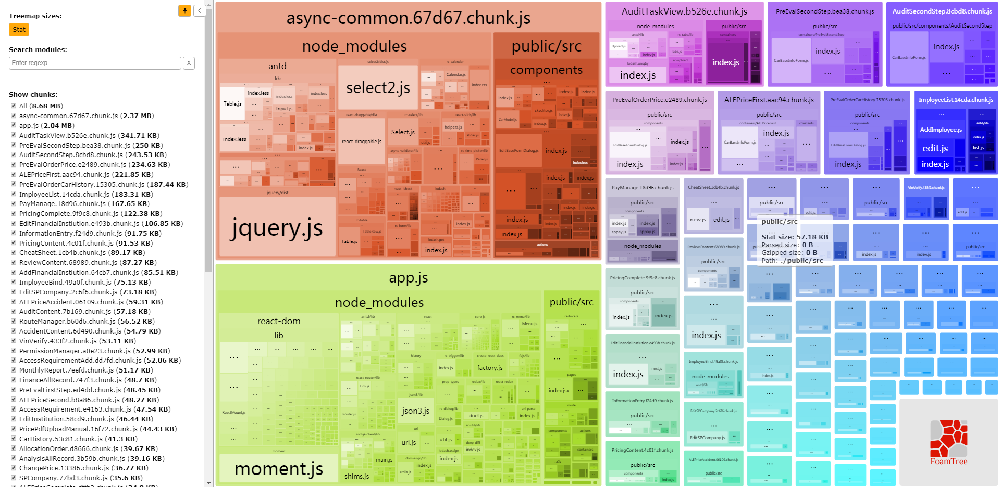

最近和同事在对公司一个React15.0+Webpack1.12.0+Ant.design的老项目进行优化，应为项目代码量已经很大，打包之后都有接近10M大小，所以我们采取了按需加载的方案，require.ensure来拆分项目代码，第一版做完所有代码拆分之后，总共有75个js，结果导致总的js代码量增加很多，变成了150M。于是开始分析，其中原因，采用了[webpack-bundle-analyzer](https://github.com/webpack-contrib/webpack-bundle-analyzer)进行分析。

### webpack-bundle-analyzer

首先要安装，webpack-bundle-analyzer是作为webpack的一个插件来使用的。
```
// 安装
npm install --save-dev webpack-bundle-analyzer

// webpack配置
const BundleAnalyzerPlugin = require('webpack-bundle-analyzer').BundleAnalyzerPlugin;

module.exports = {
  plugins: [
    new BundleAnalyzerPlugin()
  ]
}
```
webpack-bundle-analyzer可以配置analyzerPort等参数。然后我们在本地开发webpack-dev-server模式配置好，然后运行后，会打开一个单独的页面，如图所示：


> 图1 项目原始状态无压缩打包分析结果

我们可以看得出来，不同的js中有很多重复的代码，比如antd，jquery等。理所当然的，我们需要把代码中的重复代码提取出来，这样有两个好处，一是总的打包之后代码量减少，二是公共代码是比较稳定的，可以缓存在浏览器本地，加速后续打开的速度。于是，webpack官方提供了CommonsChunkPlugin插件。

### CommonsChunkPlugin
CommonsChunkPlugin的目的就是通过将公共模块拆出来，最终合成的文件能够在最开始的时候加载一次，便存到缓存中供后续使用。这个带来页面速度上的提升，因为浏览器会迅速将公共的代码从缓存中取出来，而不是每次访问一个新页面时，再去加载一个更大的文件。

> 图2 CommonsChunkPlugin基本配置分析

以上是CommonsChunkPlugin常用的配置项，常用的方式有以下几种：

#### 1、自动模式
默认状态，会将代码中所有公共模块全部提取到vendor.js中，参数都是默认值。
```
new webpack.optimize.CommonsChunkPlugin('vendor.js');
```

#### 2、指定源文件模式
会将vendor中指定的模块提取并合并到vendor.js，minChunks: Infinity时不会有其他代码合并到vendor.js中。

```
module.exports = {
  //...
  entry: {
    vendor: ['jquery', 'other-lib'],
    app: './entry'
  },
  plugins: [
    new webpack.optimize.CommonsChunkPlugin({
      name: 'vendor',
      minChunks: Infinity // 
    })
  ]
};
```  

#### 3、代码拆分模式
通过require.ensure等方式拆分代码，需要借助children来提取公共模块，代码会拼接到entry chunk上。如果async为true的时候，会重新创建一个文件来放置。

```
//...
entry: {
  app: './entry'
},
 
// 提取公共代码到app.js中
new webpack.optimize.CommonsChunkPlugin({
  children: true, 
});

// 提取代码到一个独立的chunk文件
new webpack.optimize.CommonsChunkPlugin({ 
  children: true, 
  async: true,  // 默认定义chunk名字
  // async: 'child-async',  // 指定chunk名字
});
```

### 代码优化过程

#### 1、初始状态
可以参考图1，总共有155M，很多冗余代码。有引用的第三方的npm包，也有项目中的公共组件。

#### 2、提取公共组件

主要提取了 react-select2-wrapper，jquery，select等组件，变为142M。

```
vendor: [
    'react', 'moment', 'react-dom', 'redux', 'react-select2-wrapper', 'react-router','jquery'
],

plugins:[
    new webpack.optimize.CommonsChunkPlugin({
        names: ['vendor'],
        minChunks: Infinity
    }),
    new webpack.optimize.CommonsChunkPlugin({
        name: 'manifest',
        chunks: ['vendor']
    })
]
```


> 图3 react-select2-wrapper，jquery，select

#### 3、Ant.design组件提取
因为antd是通过按需加载的方式使用的，我们不能直接把antd的所有代码都打包，于是把使用过的antd组件都明确写上，打包完之后变为131.6M。

```
vendor: [
    'react', 'moment', 'react-dom', 'redux', 'react-select2-wrapper', 'react-router','jquery',
    'antd/lib/select','antd/lib/button','antd/lib/table','antd/lib/input','antd/lib/date-picker'
],
// ...
```


> 图4 antd提取

#### 4、CSS代码提取
经过公共代码提取之后发现，每个打包之后的文件中还是有很多less和css的代码在残留，于是想到采用extract-text-webpack-plugin对代码中的css提取出来，这样打包完之后只剩下24M了。

这里需要注意的是style-loader需要删掉，不然会报错，参考：https://github.com/webpack-contrib/extract-text-webpack-plugin/issues/151#issuecomment-212377583。
```
const ExtractTextPlugin = require('extract-text-webpack-plugin');
plugins: [  
    new ExtractTextPlugin('[name].css')
].
module:{
    loaders: [{
        test: /\.css$/,
        loader: ExtractTextPlugin.extract('css-loader')
    }, {
        test: /\.less/,
        loader: ExtractTextPlugin.extract('css-loader!less-loader?')
    }]
}
```


> 图4 CSS代码提取


#### 5、children+async
但是还是发现代码比以前单独打包成一个文件的情况要大很多，所以尝试使用children+async的方式打包，牛逼了发现只剩下8.7M了。但是需要注意要增加一个参数allChunks，目的是能够将子chunk中的CSS也能提取出来，由于项目使用的webpack和ExtractTextPlugin都是1.x，所以写法也要参考[1.x](https://github.com/webpack-contrib/extract-text-webpack-plugin/blob/webpack-1/README.md)。

```
plugins: [  
    new ExtractTextPlugin('[name].css',{
        allChunks : true
    }),
    new webpack.optimize.CommonsChunkPlugin({
        children: true,
        async: 'async-common',
        minChunks: 3,
    })
]
```

但是这种方式存在一个问题，就是打包之后会有antd的某些组件css缺失，具体原因应该是和antd的按需加载机制有关系，目前还没有找到原因。暂时将所有antd的css代码引入，css文件增大了300K左右，代码如下：

```
import 'antd/dist/antd.less';  // or 'antd/dist/antd.css'
```
【**注意**】 特别强调一下这里必须使用less，因为我们使用了less-loader的modifyVars功能，去覆盖antd的less文件中的变量。



> 图5 children+async

### 总结
这次主要是采用CommonChunkPlugin对项目中公共代码进行了提取，对CommonChunkPlugin和extract-text-webpack-plugin进行了尝试，最终结果是代码从155M压缩到了8.18M。

### 参考资料
https://juejin.im/post/58edcbda44d904005774cfb1
https://www.cnblogs.com/ssh-007/p/7944491.html
https://webpack.docschina.org/plugins/commons-chunk-plugin/
https://zhuanlan.zhihu.com/p/26710831
https://github.com/sorrycc/roadhog/issues/370#issuecomment-327729950
https://github.com/webpack-contrib/extract-text-webpack-plugin/issues/151#issuecomment-212377583
https://github.com/webpack/webpack/issues/2363#issuecomment-212823262