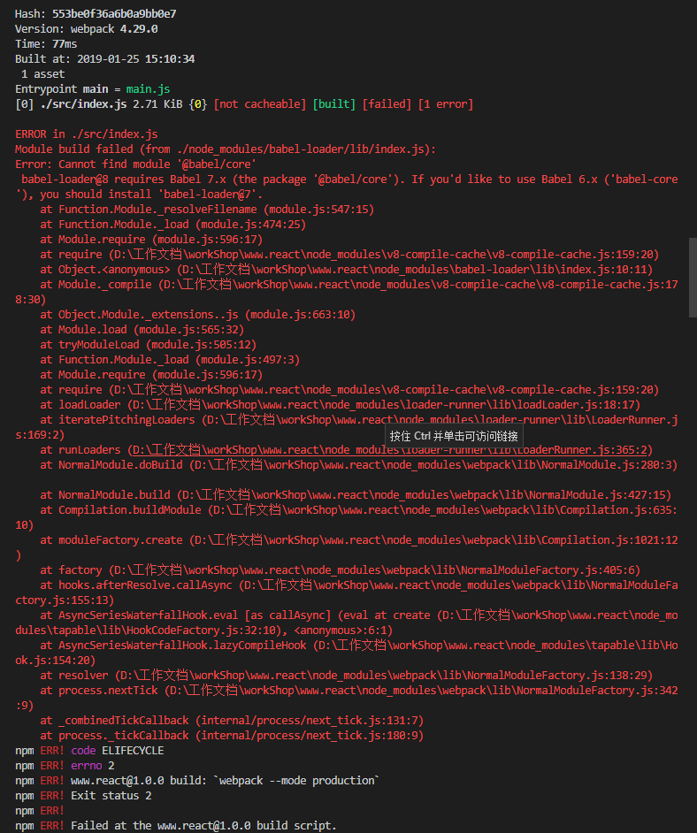
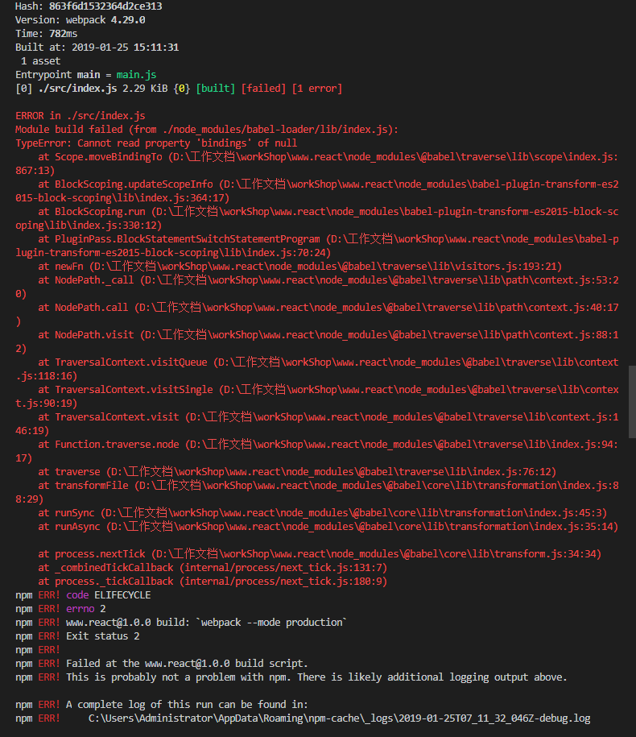
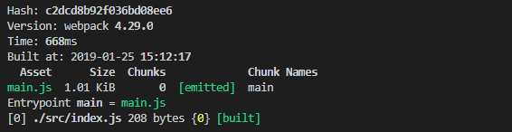

# 手动搭建 webpack + react 项目

## 初始 webpack配置

* 安装依赖包
```
npm init
npm install webpack --save-dev
npm install webpack-cli --save-dev
npm install babel-core babel-loader babel-preset-env --save-dev
```

* 创建 src/index.js
```
console.log([1,2,3]);
```

* package.json
```
<!-- 未设置 mode， 默认生产环境压缩-->
"scripts": {
    "dev": "webpack --mode development", // 不压缩
    "build": "webpack --mode production" // 压缩
}
```
    
* .babelrc
```
{
    "presets": [
        "env"
    ]
}
```

* webpack.config.js
```javascript
const path = require('path');

module.exports = {
    entry: { main: './src/index.js' },
    output: {
        path: path.resolve(__dirname, 'dist'),
        filename: 'main.js'
    },
    module: {
        rules: [
            {
                test: /\.js$/,
                exclude: /node_modules/,
                use: {
                    loader: "babel-loader"
                }
            }
        ]
    }
};
```

在 webpack.config.js 文件中使用 [轻量级的命令行参数解析引擎 minimist](https://jarvys.github.io/2014/06/01/minimist-js/), 可以获取 package.json 文件 script 中的`--env=`指令后的数据

package.json
```
script: {
    "dev": "npm run clean & npm run copy & webpack --env=dev",
}
```

webpack.config.js
```
const args = require('minimist')(process.argv.slice(2)); // { _: [], env: 'dev' }
```

* 执行 npm run build 打包

执行 npm run build 报错：


安装依赖包 @babel/core
```
npm install babel-loader @babel/core
```

执行 npm run build 又报错：


安装依赖 babel-loader v7 版本的 babel-core
```
npm install babel-loader@7 babel-core
```

执行 npm run build 成功：


## 增加不同环境 -- 配置文件

webpack v4 无需使用 config 文件，直接在 package.json -- script 中配置对应的指令文件

config/webpack.dev.js
```javascript
const path = require('path');
const merge = require("webpack-merge");
const webpack = require("webpack");
const HtmlWebpackPlugin = require("html-webpack-plugin");
const getLessVariables = require("./get-less-variables");

module.exports = merge({}, {
    mode: 'development',
    devtool: "inline-source-map",
    entry: { main: './src/index.js' },
    output: {
        path: path.resolve(__dirname, '../dist'),
        filename: 'main.js'
    },
    devServer: {
        contentBase: path.join(__dirname, '../dist'),
        headers: {
            "Access-Control-Allow-Origin": "*",
            "Access-Control-Allow-Methods":
                "GET, POST, PUT, DELETE, PATCH, OPTIONS",
            "Access-Control-Allow-Headers":
                "X-Requested-With, content-type, Authorization"
        },
        compress: true,
        host: "127.0.0.1",
        port: 9000
    },
    module: {
        rules: [
            {
                test: /\.css$/,
                use: [
                    {
                        loader: "css-loader",
                        options: {
                            importLoaders: 1,
                            sourceMap: true
                        }
                    },
                    "postcss-loader"
                ]
            },
            {
                test: /.less$/,
                use: [
                    "css-loader",
                    "postcss-loader",
                    {
                        loader: "less-loader",
                        options: {
                            strictMath: false,
                            noIeCompat: true,
                            javascriptEnabled: true,
                            globalVars: getLessVariables(
                                "./src/styles/theme.less"
                            ),
                            modifyVars: {
                                "primary-color": "#2a8cff"
                            }
                        }
                    }
                ]
            }
        ]
    },
    plugins: [
        new webpack.optimize.LimitChunkCountPlugin({
            maxChunks: 1
        }),
        new webpack.HotModuleReplacementPlugin(),
        new HtmlWebpackPlugin({
            template: "./public/index.html",
            inject: true
        })
    ]
});
```

config/webpack.beta.js
```javascript
const path = require('path');
const merge = require("webpack-merge");
const webpack = require("webpack");
const MiniCssExtractPlugin = require("mini-css-extract-plugin");
const UglifyJsPlugin = require("uglifyjs-webpack-plugin");
const CleanWebpackPlugin = require("clean-webpack-plugin");
const HtmlWebpackPlugin = require("html-webpack-plugin");
const getLessVariables = require("./get-less-variables");

function resolve(dir) {
    return path.join(__dirname, "..", dir);
}

module.exports = merge({}, {
    mode: 'production',
    devtool: "source-map",
    performance: {
        hints: "warning"
    },
    entry: {main: './src/index.js' },
    resolve: {
        extensions: [".js", ".jsx", ".json"],
        alias: {
            "@": path.join(__dirname, "../src")
        }
    },
    output: {
        // path: path.resolve(__dirname, '../dist'),
        // filename: 'main.js'
        filename: "[name].[hash].js",
        path: path.join(__dirname, "../public/build"),
        chunkFilename: "js/[name].js"
    },
    // 抽取公有代码
    optimization: {
        runtimeChunk: {
            name: "js/manifest"
        },
        splitChunks: {
            chunks: "async", //必须三选一： "initial" | "all"(推荐) | "async" (默认就是async)
            minSize: 30000, //压缩前的最小大小
            maxSize: 0, //压缩前的最小大小
            minChunks: 1, //引用次数
            maxAsyncRequests: 5, // 最大异步请求数， 默认5
            maxInitialRequests: 3, // 最大初始化请求书，默认3
            automaticNameDelimiter: "~", // 打包分隔符
            name: true, //默认为 true，表示自动生成文件名，打包后的名称，此选项可接收 function

            // 缓存组
            cacheGroups: {
                commons: {
                    // 正则规则验证，如果符合就提取 chunk
                    test: /[\\/]node_modules[\\/]/,
                    name: "vendor",
                    chunks: "all"
                },
                //
                styles: {
                    name: "styles",
                    test: /\.css|less$/,
                    chunks: "all",
                    enforce: true,
                    priority: 20
                }
            }
        },
        minimizer: [
            new UglifyJsPlugin({
                test: /\.js($|\?)/i,
                include: path.join(__dirname, "/../src"),
                sourceMap: true,
                parallel: true,
                cache: true,
                uglifyOptions: {
                    ie8: false,
                    ecma: 8
                }
            })
        ]
    },
    module: {
        rules: [
            {
                test: /\.css$/,
                use: [
                    {
                        loader: MiniCssExtractPlugin.loader,
                        options: {
                            publicPath: "./"
                        }
                    },
                    {
                        loader: "css-loader",
                        options: {
                            importLoaders: 1,
                            sourceMap: true
                        }
                    },
                    "postcss-loader"
                ]
            },
            {
                test: /.less$/, // antd 中的less
                include: resolve("node_modules"),
                // exclude: [/src/],
                // include: path.resolve(__dirname, 'node_modules/antd'),
                use: [
                    {
                        loader: MiniCssExtractPlugin.loader,
                        options: {
                            publicPath: "./"
                        }
                    },
                    "css-loader",
                    "postcss-loader",
                    {
                        loader: "less-loader",
                        options: {
                            strictMath: false,
                            noIeCompat: true,
                            javascriptEnabled: true,
                            modifyVars: {
                                "primary-color": "#2a8cff"
                            }
                        }
                    }
                ]
            },
            {
                test: /\.less$/,
                include: path.join(__dirname, "/../src"),
                // exclude: [/node_modules/],
                use: [
                    MiniCssExtractPlugin.loader,
                    {
                        loader: "css-loader",
                        options: {
                            // modules: true,
                            // localIdentName: '[local]--[hash:base64:5]',
                            // importLoaders: 2,
                        }
                    },
                    "postcss-loader",
                    {
                        loader: "less-loader",
                        options: {
                            strictMath: false,
                            noIeCompat: true,
                            javascriptEnabled: true,
                            globalVars: getLessVariables(
                                "./src/styles/theme.less"
                            )
                        }
                    }
                ]
            },
            {
                test: /\.s[ac]ss$/,
                use: [
                    MiniCssExtractPlugin.loader,
                    "css-loader",
                    "postcss-loader",
                    "sass-loader"
                ]
            }
        ]
    },
    plugins: [
        new CleanWebpackPlugin(path.resolve(__dirname, "../public/build"), {
            root: path.resolve(__dirname, "../"), // 设置 root
            verbose: true
        }),
        new HtmlWebpackPlugin({
            template: "./public/index.html",
            filename: "index.html",
            chunksSortMode: function(chunk1, chunk2) {
                return chunk1.id - chunk2.id;
            },
            minify: {
                collapseWhitespace: true
            }
        }),
        new webpack.DefinePlugin({
            "process.env.NODE_ENV": JSON.stringify("production")
        }),
        new MiniCssExtractPlugin({
            filename: "css/[name].[hash].css"
        }),
        new webpack.HashedModuleIdsPlugin()
    ]
});
```

config/webpack.prod.js
```javascript
const webpack = require("webpack");
const path = require("path");
const merge = require("webpack-merge");
const MiniCssExtractPlugin = require("mini-css-extract-plugin");
const UglifyJsPlugin = require("uglifyjs-webpack-plugin");
const CleanWebpackPlugin = require("clean-webpack-plugin");
const HtmlWebpackPlugin = require("html-webpack-plugin");
const getLessVariables = require("./get-less-variables");

function resolve(dir) {
    return path.join(__dirname, "..", dir);
}

module.exports = merge({}, {
    mode: "production",
    // devtool: "source-map",
    performance: {
        hints: "warning"
    },
    output: {
        filename: "[name].js",
        path: path.join(__dirname, "../public/build/[hash:16]"),
        chunkFilename: "js/[name].js"
    },
    // 抽取公有代码
    optimization: {
        runtimeChunk: {
            name: "js/manifest"
        },

        splitChunks: {
            chunks: "async", //必须三选一： "initial" | "all"(推荐) | "async" (默认就是async)
            minSize: 30000, //压缩前的最小大小
            maxSize: 0, //压缩前的最小大小
            minChunks: 1, //引用次数
            maxAsyncRequests: 5, // 最大异步请求数， 默认5
            maxInitialRequests: 3, // 最大初始化请求数，默认3
            automaticNameDelimiter: "~", // 打包分隔符
            name: true, //默认为 true，表示自动生成文件名，打包后的名称，此选项可接收 function

            // 缓存组
            cacheGroups: {
                commons: {
                    minChunks: 2,
                    maxInitialRequests: 5,
                    minSize: 0
                },
                vendor: {
                    test: /[\\/]node_modules[\\/]/,
                    chunks: "initial",
                    name: "vendor",
                    priority: 10,
                    enforce: true
                },
                styles: {
                    name: "styles",
                    test: /\.css|less$/,
                    chunks: "all",
                    enforce: true,
                    priority: 20
                }
            }
        },
        minimizer: [
            new UglifyJsPlugin({
                test: /\.js($|\?)/i,
                include: path.join(__dirname, "/../src"),
                sourceMap: true,
                parallel: true,
                cache: true,
                uglifyOptions: {
                    ie8: false,
                    ecma: 8
                }
            })
        ]
    },
    module: {
        rules: [
            {
                test: /\.css$/,
                use: [
                    {
                        loader: MiniCssExtractPlugin.loader,
                        options: {
                            publicPath: "./"
                        }
                    },
                    {
                        loader: "css-loader",
                        options: {
                            importLoaders: 1,
                            sourceMap: true
                        }
                    },
                    "postcss-loader"
                ]
            },
            {
                test: /.less$/, // antd 中的less
                include: resolve("node_modules"),
                // exclude: [/src/],
                // include: path.resolve(__dirname, 'node_modules/antd'),
                use: [
                    {
                        loader: MiniCssExtractPlugin.loader,
                        options: {
                            publicPath: "./"
                        }
                    },
                    "css-loader",
                    "postcss-loader",
                    {
                        loader: "less-loader",
                        options: {
                            strictMath: false,
                            noIeCompat: true,
                            javascriptEnabled: true,
                            modifyVars: {
                                "primary-color": "#2a8cff"
                            }
                        }
                    }
                ]
            },
            {
                test: /\.less$/,
                include: path.join(__dirname, "/../src"),
                // exclude: [/node_modules/],
                use: [
                    MiniCssExtractPlugin.loader,
                    {
                        loader: "css-loader",
                        options: {
                            // modules: true,
                            // localIdentName: '[local]--[hash:base64:5]',
                            // importLoaders: 2,
                        }
                    },
                    "postcss-loader",
                    {
                        loader: "less-loader",
                        options: {
                            strictMath: false,
                            noIeCompat: true,
                            javascriptEnabled: true,
                            globalVars: getLessVariables(
                                "./src/styles/theme.less"
                            )
                        }
                    }
                ]
            },
            {
                test: /\.s[ac]ss$/,
                use: [
                    MiniCssExtractPlugin.loader,
                    "css-loader",
                    "postcss-loader",
                    "sass-loader"
                ]
            }
        ]
    },
    plugins: [
        new CleanWebpackPlugin(
            path.resolve(__dirname, "../public/build"),
            {
                root: path.resolve(__dirname, "../"), // 设置root
                verbose: true
            }
        ),
        new HtmlWebpackPlugin({
            template: "./public/index.html",
            filename: "index.html",
            chunksSortMode: function(chunk1, chunk2) {
                return chunk1.id - chunk2.id;
            },
            minify: {
                collapseWhitespace: true
            }
        }),
        new webpack.DefinePlugin({
            "process.env.NODE_ENV": JSON.stringify("production")
        }),
        new MiniCssExtractPlugin({
            filename: "css/[name].css"
        }),
        new webpack.HashedModuleIdsPlugin()
    ]
});
```