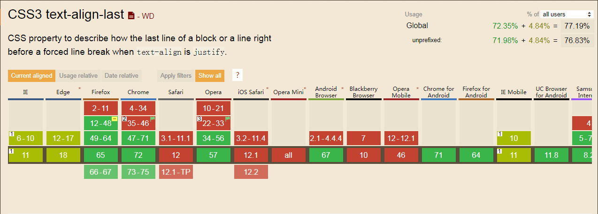

# css 属性

## 一、css 布局

提到 HTML 页面布局时，通常会优先使用 Float、Position、Flex 等方式实现。如果页面对兼容性要求不是很高，还可以使用 `display: grid`。

`Grid` 属性需要一个 `grid 容器`，其子元素被称之为 `grid 子项`，其布局方式类似于[农田式划分](https://www.zhangxinxu.com/wordpress/2018/11/display-grid-css-css3/)。

`calc` [css 函数](https://developer.mozilla.org/zh-CN/docs/Web/CSS/calc)

`::nth-child(n)` 伪类选择器：指定第n个元素； `li::nth-of-type(n)` 伪类元素选择器：指定第n个某元素。

```html
<div id="app">
    <header id="header">header</header>
    <aside id="side">side</aside>
    <div id="main">main</div>
    <footer id="footer">footer</footer>
</div>
```

四种方式实现页面布局:

```css
* {
    margin: 0;
    padding: 0;
}

html,
body,
#app {
    margin: 0;
    padding: 0;
    height: 100%;
}

#header,
#footer {
    height: 50px;
    line-height: 50px;
    text-align: center;
    background: #555;
    color: #fff;
}

#side {
    width: 200px;
    background: #eee;
}

/* 1、float 浮动处理 */
#side {
    /* 设置 侧边栏 左浮动 */
    float: left;
    height: calc(100% - 100px);
}

#main {
    height: calc(100% - 100px);
    overflow: hidden;
}

/* 2、position 定位处理 */
#app {
    /* 父级元素 设置 相对定位 */
    position: relative;
}
#side {
    /* 左边栏 设置 绝对定位 */
    position: absolute;
    top: 50px;
    bottom: 50px;
    left: 0;
}
#main {
    /* 内容区 设置 绝对定位 */
    position: absolute;
    top: 50px;
    right: 0;
    bottom: 50px;
    left: 200px;
}
#footer {
    /* footer 设置 绝对定位 */
    position: absolute;
    bottom: 0;
    width: 100%;
    /* 设置浮动后，补上宽度 */
}

/* 3、flex 弹性处理 */
#app {
    display: flex;
    flex-wrap: wrap;
}
#header {
    flex-basis: 100%;
}
#side {
    height: calc(100% - 100px);
}
#main {
    flex: 1;
    height: calc(100% - 100px);
}
#footer {
    flex-basis: 100%;
}

/* 4、grid 处理 */
#app {
    display: grid;
    /**
    等价于
    grid-template-rows: 50px auto 50px;
    grid-template-columns: 200px auto;
    grid-template-areas: 
        "header header" 
        "side main" 
        "footer footer";
    grid: grid-template-rows / grid-template-columns;
    注意： 每一 row 只是一个字符串
    */
    grid: "header header"50px "side main"auto "footer footer"50px / 200px auto;
}
#header {
    /* 注意： header 没有双引号 */
    grid-area: header;
}
#footer {
    grid-area: footer;
}

/* 伪类选择器 + 伪类元素选择器 */
ul li:nth-child(2n)::after {
    content: '|';
}
ul li:nth-of-type(2n)::after {
    content: '|';
}
```

## 二、css 之文本两端对齐

### 简单实例

文本两端对齐，首先想到的就是 `text-align: justify`，在实际的应用中，一段文本内容：
```html
<div style="text-align: justify;text-indent: 2em; /* 首行缩进 */width: 300px;">
    两端对齐相对于左对齐，视觉上显得整齐有序。但justify对最后一行无效，通常这样的排版对整段文字是极好的，我们并不希望当最后一行只有两个字时也两端对齐，毕竟这是不便于阅读的，那么当我们只有一行文本，但要实现单行文本两端对齐怎么解决
</div>
```

* 但是这个属性对文本的最后一行无效，需要强制最后一行做对齐处理，例如:

```html
<ul style="list-style: none">
    <li class="item">
        <span class="label" >姓名</span>：
        <span class="value">wqjiao</span>
    </li>
    <li class="item">
        <span class="label" >出生年月日</span>：
        <span class="value">1992.05.25</span>
    </li>
    <li class="item">
        <span class="label" >户籍所在地</span>：
        <span class="value">安徽 怀远</span>
    </li>
</ul>
```
```scss
.item {
    height: 32px;
    line-height: 32px;
    margin-bottom: 8px;
    .label {
        display: inline-block;
        height: 100%;
        width: 100px;
        text-align: justify;
        vertical-align: top;
        &::after {
            display: inline-block;
            width: 100%;
            content: ''; // 多出一倍的高度，多出21
            height: 0;
        }
    }
    .value {
        padding-right: 10px;
    }
}
```

* 但是，以上实现方法比较麻烦，css 新属性 [text-align-last](https://developer.mozilla.org/zh-CN/docs/Web/CSS/text-align-last)，该属性定义的是一段文本中最后一行在被强制换行之前的对齐规则。以上 scss 可以更换成：

```scss
.item {
    margin-bottom: 8px;
    .label {
        display: inline-block;
        height: 100%;
        min-width: 100px;
        text-align: justify;
        -ms-text-align-last: justify;
        -moz-text-align-last: justify;
        text-align-last: justify;
    }
    .value {
        padding-right: 10px;
    }
}
```

### `text-align-last` 属性介绍

CSS 属性 text-align-last  描述的是一段文本中最后一行在被强制换行之前的对齐规则。

* 特性

默认值 auto；
适用于 block 容器元素；
属性可继承

* 语法

auto | start | end | left | right | center | justify

* 属性值

    - auto

    每一行的对齐规则由 text-align 的值来确定，当 text-align 的值是 justify，text-align-last 的表现和设置了 start 的表现是一样的，即如果文本的展示方向是从左到右，则最后一行左侧对齐与内容盒子。
    译者注：
    经测试，当 text-align 的值为 right，并且 text-align-last 设置为 auto 时，文本最后一行的对齐方式相当于 text-align-last 被设置为 right 时的效果。即 text-align-last 设置为 auto 后的表现跟 text-align 的设置有关。

    - start
    
    与 direction 的设置有关。
    如果文本展示方向是从左到右，起点在左侧，则是左对齐；
    如果文本展示方向是从右到左，起点在右侧，则是右对齐。
    如果没有设置 direction ，则按照浏览器文本的默认显示方向来确定。

    direction 默认值 从左到右 ltr
        ltr -- 从左到右
        rtl -- 从右到左
    
    - end
    
    与 direction 的设置有关。
    如果文本展示方向是从左到右，末尾在右侧，则是右对齐；
    如果文本展示方向是从右到左，末尾在左侧，则是左对齐。
    如果没有设置 direction ，则按照浏览器文本的默认显示方向来确定。
    
    - left
    
    最后一行文字与内容盒子的左侧对齐
    
    - right
    
    最后一行文字与内容盒子的右侧对齐
    
    - center
    
    最后一行文字与内容盒子居中对齐
    
    - justify

    最后一行文字的开头语内容盒子的左侧对齐，末尾与右侧对齐。

* 浏览器兼容性




## 三、shape-outside

[shape-outside](https://css-tricks.com/almanac/properties/s/shape-outside/) 的CSS 属性定义了一个可以是非矩形的形状，相邻的内联内容应围绕该形状进行包装。 默认情况下，内联内容包围其边距框; shape-outside提供了一种自定义此包装的方法，可以将文本包装在复杂对象周围而不是简单的框中。

* 关键字值

    ```css
    shape-outside: none;
    shape-outside: margin-box;
    shape-outside: content-box;
    shape-outside: border-box;
    shape-outside: padding-box;
    ```

    - margin-box

    定义一个由外边距的外边缘封闭形成的形状。这个形状的角的半径由相应的border-radius 和margin 的值决定。如果 border-radius / margin 的比率大于等于 1 , 那么这个 margin box 的角的弧度就是 border-radius + margin ；如果比率小于 1，那么这个 margin box 的角的弧度就是 border-radius + (margin * (1 + (ratio-1)^3)) 。

    - border-box

    定义一个由边界的外边缘封闭形成的形状。 这个形状遵循正常的边界外部圆角的形成规则。

    - padding-box

    定义一个由内边距的外边缘封闭形成的形状。这个形状遵循正常的边界内部圆角的形成规则。

    - content-box

    定义一个由内容区域的外边缘封闭形成的形状（译者：表述的不太好，就是被padding包裹的区域，在chrome控制台中的盒子模型图中的蓝色区域。）。每一个角的弧度取 0 或 border-radius - border-width - padding 中的较大值。

* 函数值

```css
shape-outside: circle(arg); /* 创建圆 circle(50%) */
shape-outside: polygon(arg); /* 创建多边形 */
shape-outside: ellipse(arg); /* 创建椭圆 ellipse(150px 300px at 50% 50%) */
shape-outside: inset(arg); /* 创建矩形 */
```

* url 值

```css
shape-outside: url(image.png);
```

* 渐变值

```css
shape-outside: linear-gradient(45deg, rgba(255, 255, 255, 0) 150px, red 150px);
```

* 全局值

```css
shape-outside: initial; /* 浮动区域不受影响 */
shape-outside: inherit; /* 从父元素继承形状外部值 */
shape-outside: unset;
```

[shape-outside](https://developer.mozilla.org/zh-CN/docs/Web/CSS/shape-outside) 属性指定使用下面列表的值来定义浮动元素的浮动区域。这个浮动区域决定了行内内容（浮动元素）所包裹的形状。

`需要注意的是该属性只对 浮动 的容器元素有效。` 

## 四、css3 filter 滤镜

* filter 语法

```css
/* URL to SVG filter */
filter: url("filters.svg#filter-id");

/* <filter-function> values */
filter: blur(5px);
filter: brightness(0.4);
filter: contrast(200%);
filter: drop-shadow(16px 16px 20px blue);
filter: grayscale(50%);
filter: hue-rotate(90deg);
filter: invert(75%);
filter: opacity(25%);
filter: saturate(30%);
filter: sepia(60%);

/* Multiple filters */
filter: contrast(175%) brightness(3%);

/* Global values */
filter: inherit;
filter: initial;
filter: unset;
```

* 实现 滤镜效果

```html
<!-- hover 隐藏显示||图片定位 -->
<div class="wraper">
    
    
</div>

<!-- css3 filter 滤镜效果 -->

```

```css
/* hover 隐藏显示||图片定位 */
.wraper {
    position: relative;
    height: 32px;
}
.wraper >img {
    cursor: pointer;
    position: absolute;
    opacity: 0;
    transition: all 0.2s;
}
.wraper .logo2 {
    opacity: 1;
}
.wraper:hover .logo1{
    opacity: 1;
}
.wraper:hover .logo2{
    opacity: 0;
}

/* css3 filter 滤镜 */
.logo {
    transition: all 0.2s;
    cursor: pointer;
    /* filter: grayscale(1); */
    filter: sepia(1);
}
.logo:hover {
    filter: none;
}
```

## 五、css 特效

[GitHub 地址](https://github.com/chokcoco/CSS-Inspiration)

* [日本 CodePen 作者 Yusuke Nakaya 的实例](https://codepen.io/YusukeNakaya/pen/vvEqVx)
    - DOM 元素
    ```js
    import React, { Fragment } from 'react';specialEffects
    import './index.scss';

    class specialEffects extends React.Component {

        // 创建 trigger
        createElement(count, type) {
            let html = [];

            for (let i = 0; i < count; i++) {
                html.push(<div className={type} key={type + i}></div>);
            }
            
            return (html);
        }

        render() {
            let createBox = this.createElement(500, 'box');

            return (
                <Fragment>
                    <div className="bg">hover me</div>
                    <div className="container">
                        {createBox}
                    </div>
                </Fragment>
            );
        }
    }

    export default specialEffects;
    ```

    - css 特效
    ```scss
    $count: 500;
    @function randomNum($max, $min: 0, $u: 1) {
        @return ($min + random($max)) * $u;
    }

    .bg {
        position: absolute;
        top: 0;
        left: 0;
        width: 100vw;
        height: 100vh;
        line-height: 100vh;
        text-align: center;
        font-size: 15vw;
        -webkit-text-fill-color: transparent;
        -webkit-text-stroke: 1px rgba(118, 218, 255, .8);
        z-index: -1;
    }

    .container {
        width: 100vw;
        height: 100vh;
        overflow: hidden;
        cursor: pointer;
        z-index: 100;
        .box {
            position: relative;
            float: left;
            width: 30px;
            height: 30px;
            margin: 4px; // mix-blend-mode: multiply;    
            &::before {
                content: "";
                position: absolute;
                top: 0;
                left: 0;
                right: 0;
                bottom: 0;
                border-radius: 50%;
                transform: scale3d(0.1, 0.1, 1);
                background-color: transparent;
                transition: .5s transform ease-in, .5s background ease-in;
            }
        }
        .box:hover {
            &::before {
                transform: scale3d(1.8, 1.8, 1.8);
                transition: 0s transform;
            }
        }
    }

    @for $i from 1 through $count {
        .box:nth-child(#{$i}):hover {
            &::before {
                background-color: rgba(randomNum(255), randomNum(255), randomNum(255), .8);
            }
        }
    }
    ```

## 六、clip-path

[clip-path](https://developer.mozilla.org/zh-CN/docs/Web/CSS/clip-path) 属性可以创建一个只有元素的部分区域可以显示的剪切区域。区域内的部分显示，区域外的隐藏。剪切区域是被引用内嵌的URL定义的路径或者外部svg的路径，或者作为一个形状例如circle()。clip-path属性代替了现在已经弃用的剪切 clip 属性。

```css
clip-path: circle(40%);
clip-path: ellipse(130px 140px at 10% 20%);
clip-path: polygon(50% 0, 100% 50%, 50% 100%, 0 50%);
```

## 七、[sass 在线转 css](https://www.sassmeister.com/)

## 八、控制文本属性

* `text-transform` 属性用来控制元素文本的大小写。

    ```
    none	    默认。定义带有小写字母和大写字母的标准的文本。
    capitalize	文本中的每个单词以大写字母开头。
    uppercase	定义仅有大写字母。
    lowercase	定义仅有小写字母。
    inherit	    规定应该从父元素继承 text-transform 属性的值。
    ```

* `font-variant` 属性用来将元素文本变成小型大写字母字体

    ```
    normal	    默认值。浏览器会显示一个标准的字体。
    small-caps	浏览器会显示小型大写字母的字体。
    inherit	    规定应该从父元素继承 font-variant 属性的值。
    ```
* `::first-letter` 属性作用于第一行中的第一个字母

`:: first-letter` 是一个伪元素，它选择块级元素第一行中的第一个字母（如段落 <p>），如果该字母没有任何其他内容（如图像或内联表）。

注意：`:: first-letter` 伪元素不选择内联级元素的第一个字母：即具有 `display：inline` 的元素。它只适用于显示值为 `block、inline-block、table-cell、table-caption` 或 `list-item` 的元素。

```js
<p>“我是一个段落”</p>
<p>“My name is Mike”</p>
```
```css
p::first-letter {
    font-size: 24px;
    color: red;
}
p::before {
    content: '我是伪元素添加的内容。';
    color: pink;
}
```

* `::first-line` 属性作用于第一行

`::first-line` 与 `::first-letter` 类似，它选择块级元素第一行

```html
<div>
    <p style="display: inline-block">
        Hello,
        <br>
        Goodbye
    </p>
    Mike!
</div>
```

在上面代码中，p标签是行内块元素
```css
div::first-line {
    font-size: 24px;
    color: red; 
}
```

* `text-indent` 属性用于首行缩进

## 九、:is() || :matchs() || :any()

浏览器兼容性不好，目前兼容 Safari

`:matches()` CSS 伪类 函数将选择器列表作为参数，并选择该列表中任意一个选择器可以选择的元素。这对于以更紧凑的形式编写大型选择器非常有用。

注意，许多浏览器通过一个更旧的、带前缀的伪类 `:any()` 来支持这个功能，包括旧版本的 Chrome、Firefox 和 Safari。这与 `:matches()` 的工作方式完全相同，只是它需要厂商前缀，不支持复杂的选择器。

```css
/* 选择header, main, footer里的任意一个悬浮状态的段落(p标签) */
:matches(header, main, footer) p:hover {
  color: red;
  cursor: pointer;
}

:is(header, main, footer) p:hover {
    color: red;
    cursor: pointer;
}

/* 以上内容相当于以下内容 */
header p:hover,
main p:hover,
footer p:hover {
    color: red;
    cursor: pointer;
}


/* 向后兼容的版本:-*-any() */
:-moz-any(header, main, footer) p:hover,
:-webkit-any(header, main, footer) p:hover,
:matches(header, main, footer) p:hover {
    color: red;
    cursor: pointer;
}
```

## 十、文字超出宽度换行属性 -- 单词

```css
/* 文字超出换行 */
div {
    white-space: normal;
    /* 在长单词或 URL 地址内部进行换行 */
    word-wrap: break-word;
    /* 允许在单词内换行 */
    word-break: break-all;
}
```

* word-break

* word-wrap

## 十一、css 波纹动画

两张图片重叠，只 `scale` 其中一个图片即可。

```html
<div class="repetBox">
    <div class="transform"></div>
</div>
```


```css
/* 表面不发生变化的圆 */
.repetBox {
    width: 100px;
    height: 100px;
    border: 1px solid #e5e5e5;
    border-radius: 50%;
    position:relative;
}
/* 波纹动画的圆 */
.transform {
    width: 100px;
    height: 100px;
    border: 1px solid #e5e5e5;
    border-radius: 50%;
    position:absolute;
    top: 0px;
    left: 0px;
    cursor: pointer;
    -webkit-animation: scaleout 1.3s infinite ease-in-out;
    animation: scaleout 1.3s infinite ease-in-out;
}
@keyframes scaleout {
    0% {
        transform: scale(1.0);
        -webkit-transform: scale(1.0);
    }
    100% {
        transform: scale(1.2);
        -webkit-transform: scale(1.2);
        opacity: 0;
    }
}
```

## 十二、div 包裹 img 不做任务设置的情况下img与div下面有白边

```html
<div>
    
</div>
```

```css
div, img {
    margin: 0;
    padding: 0;
}
div {
    width: 100%
}
```

* 方法一
```css
div {
    height: 250px;
}
```

* 方法二
```css
div {
    font-size: 0;
}
```

* 方法三
```css
div {
    line-height: 0;
}
```

* 方法四
```css
img {
    display: block;
}
```

## 十三、使用 translate 字体变模糊情况

* 使用 `translate2d` 出现模糊
    因为元素的高度、宽度中有奇数， 使用 `translate(-50%,-50%)` 之后，相当于宽度、高度除以2的效果，会出现 0.5px。浏览器能分辨的最小像素为1px，因此出现了模糊。
    所以，使用 `translate(-50%,-50%)` 的时候，一定要注意让元素的宽度、高度为偶数。

* 使用 `translate3d` 出现模糊
    里面的值用固定参数而不是百分比，如 `translate3d(50px,10px,10px)`, 则不会模糊。原因尚未明确。
