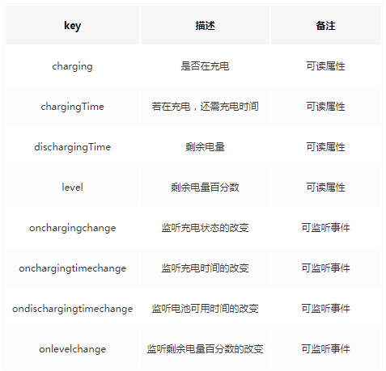

## 1.监听屏幕旋转变化接口: orientationchange
```
orientation.angle 屏幕方向
    0	            竖屏
    90	            向左横屏
    -90/270	        向右横屏
    180	            倒屏
```

```js
screenOrientation = () => {
    let me = this;
    let orientation = screen.orientation || screen.mozOrientation || screen.msOrientation;
    console.log('*angle*', screen, screen.orientation)
    window.addEventListener("onorientationchange" in window ? "orientationchange" : "resize", function () {
        me.angle = orientation.angle;
        console.log('*onorientationchange*', orientation)
    });
}
```

## 2. 电池状态：navigator.getBattery()
```js
getBatteryInfo = () => {
    let me = this;
    if (navigator.getBattery) {
        navigator.getBattery().then(function (battery) {
            // 判断是否在充电
            me.batteryInfo = battery.charging ? `在充电 : 剩余 ${battery.level * 100}%` : `没充电 : 剩余 ${battery.level * 100}%`;
            // 电池充电状态改变事件
            battery.addEventListener('onchargingchange', function () {
                me.batteryInfo = battery.charging ? `在充电 : 剩余 ${battery.level * 100}%` : `没充电 : 剩余 ${battery.level * 100}%`;
            });
        });
    } else {
        me.batteryInfo = '不支持电池状态接口';
    }
    console.log(navigator.getBattery, me.batteryInfo)
}
```
`navigator.getBattery` 监听事件


## 3. 让你的手机震动: window.navigator.vibrate(200)

```js
vibrateFun = () => {
    let me = this;
    if (navigator.vibrate) {
        navigator.vibrate([500, 500, 500, 500, 500, 500, 500, 500, 500, 500]);
    } else {
        me.vibrateInfo = "您的设备不支持震动";
    }

    // // 清除震动 
    // navigator.vibrate(0);
    // // 持续震动
    // setInterval(function () {
    //     navigator.vibrate(200);
    // }, 500);
}
```

## 4. 当前语言：navigator.language

```js
getThisLang = () => {
    const langList = ['cn', 'hk', 'tw', 'en', 'fr'];
    const langListLen = langList.length;
    const thisLang = (navigator.language || navigator.browserLanguage).toLowerCase();
    for (let i = 0; i < langListLen; i++) {
        let lang = langList[i];
        if (thisLang.includes(lang)) {
            return lang
        } else {
            return 'en'
        }
    }
}
```

## 5. 联网状态：navigator.onLine

注意：navigator.onLine 只会在机器未连接到局域网或路由器时返回 false，其他情况下均返回 true。 也就是说，机器连接上路由器后，即使这个路由器没联通网络，navigator.onLine 仍然返回 true。
```js
updateOnlineStatus = () => {
    var me = this;
    console.log('navigator.onLine', navigator.onLine)
    me.onLineInfo = navigator.onLine ? "online" : "offline";
}
window.addEventListener('online', me.updateOnlineStatus, true);
window.addEventListener('offline', me.updateOnlineStatus, true);
```

## 6. 页面可编辑：contentEditable

在地址栏中输入 data:text/html, <html contenteditable> 实现页面可编辑，在实际需求中可使用 `<div class='haveInput' contentEditable='true' placeholder='请输入'></div>` 代替 `<textarea></textarea>`

## 7. 浏览器活跃窗口监听: window.onblur(失去焦点) & window.onfocus(活跃状态)
浏览其他窗口、浏览器最小化、点击其他程序等， window.onblur 事件就会触发;回到该窗口， window.onfocus 事件就会触发。
```js
doFlashTitle = () => {
    let me = this;
    me.timer = setInterval(() => {
        if (!me.flashFlag) {
            document.title = "微信网页版";
        } else {
            document.title = `微信（${me.infoNum}）`;
        }
        me.flashFlag = !me.flashFlag
    }, 500)
}
window.addEventListener('blur', me.doFlashTitle, true);
window.addEventListener('focus', function () {
    clearInterval(me.timer);
    document.title = '微信网页版';
}, true);
```

## 8. 全屏 API（Fullscreen API）

* 进入全屏
```js
launchFullscreen(element) {
    //此方法不可以在異步任務中執行，否則火狐無法全屏
    if (element.requestFullscreen) {
        element.requestFullscreen();
    } else if (element.mozRequestFullScreen) {
        element.mozRequestFullScreen();
    } else if (element.msRequestFullscreen) { 
        element.msRequestFullscreen(); 
    } else if (element.oRequestFullscreen) {
        element.oRequestFullscreen();
    }
    else if (element.webkitRequestFullscreen) {
        element.webkitRequestFullScreen();
    } else {
        var docHtml = document.documentElement;
        var docBody = document.body;
        var videobox = document.getElementById('videobox');
        var cssText = 'width:100%;height:100%;overflow:hidden;';

        docHtml.style.cssText = cssText;
        docBody.style.cssText = cssText;
        videobox.style.cssText = cssText + ';' + 'margin:0px;padding:0px;';
        document.IsFullScreen = true;
    }
}
me.launchFullscreen(document.documentElement);
```

* 退出全屏
```js
exitFullscreen = () => {
    if (document.exitFullscreen) {
        document.exitFullscreen();
    } else if (document.msExitFullscreen) {
        document.msExitFullscreen();
    } else if (document.mozCancelFullScreen) {
        document.mozCancelFullScreen();
    } else if (document.oRequestFullscreen) {
        document.oCancelFullScreen();
    }else if (document.webkitExitFullscreen) {
        document.webkitExitFullscreen();
    } else {
        var docHtml = document.documentElement;
        var docBody = document.body;
        var videobox = document.getElementById('videobox');

        docHtml.style.cssText = "";
        docBody.style.cssText = "";
        videobox.style.cssText = "";
        document.IsFullScreen = false;
    }
}
me.exitFullscreen()
```
