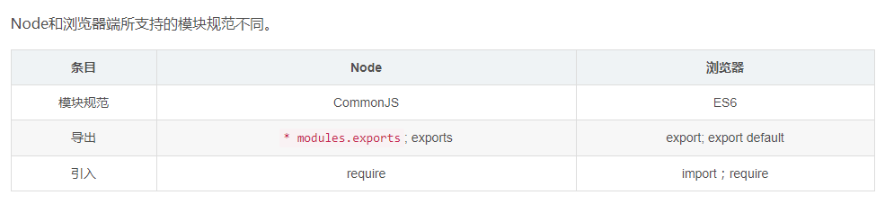

# 学习 Node 之笔记

## 一、Node 关联

* [Node](https://nodejs.org/zh-cn/download/) 下载

* 安装注意事项

    - Node.js runtime 表示运行环境
    - npm package manager 表示npm包管理器
    - online documentation shortcuts 在线文档快捷方式
    - Add to PATH 添加到环境变量
    - koa2-cors  解决 Node 跨域难题

### Redis

* windows 下载
    在 [Redis](https://redis.io/) 官网上只有 Linux 系统的安装包，若下载 windows 系统的包，需要在 [github Redis](https://github.com/MicrosoftArchive/redis/releases) 中下载。

* Redis 安装
    - 测试是否安装成功
    `redis-server redis.windows.conf`

    - 在 `Redis` 的安装根目录下找到 `redis-cli.exe` 文件启动或在 cmd 中先进入 `Redis` 的安装根目录用命令`redis-cli.exe -h 192.168.10.61 -p 6379`（注意换成自己的IP）的方式打开
    
    - 测试方法
    设置键值对 `set myKey abc`
    取出键值对 `get myKey`

### MongoDB
    [MongoDB 中文文档](http://www.mongoing.com/docs/)

* [MongoDB 下载网址](https://www.mongodb.com/download-center/community?jmp=nav)

* [安装步骤参考网址](https://segmentfault.com/a/1190000007983963)

* 在 `MongoDB/bin` 文件夹下使用 `cmd` 并输入 `mongod -dbpath "D:/Program Files/MongoDB/Server/4.0/data/db"`

* 打开 `cmd` 找到 `mongodb\bin` 所在位置 输入 `mongod --logpath "D:/Program Files/MongoDB/Server/4.0/log/mongd.log" --logappend --dbpath "D:/Program Files/MongoDB/Server/4.0/data" --install`

* 回车后 按 `win+r` 输入 `services.msc` 找到 `MongoDB` 右键手动开启
    - 启动MongoDB服务
        `net start MongoDB`
    - 关闭MongoDB服务
        `net stop MongoDB`

* MongoDB Api

    - 1.链接 MongoDB -- app.js
    ```js
    // https://mongoosejs.com/docs/deprecations.html
    mongoose.set('useCreateIndex', true); // DeprecationWarning: collection.ensureIndex is deprecated. Use createIndexes instead.
    mongoose.connect(config.db, {useNewUrlParser: true}, (err) => {
        if (err) {
            console.error('Failed to connect to database');
        } else {
            console.log('Connecting database successfully');
        }
    });
    ```

    - 2.创建 `node` 接口 -- api
    ```js
    // LeetCode 题库数据获取
    const router = require('koa-router')();
    const leetCode = require('../model/leetCode');

    router.get('/leetCode', async (ctx, next) => {
        const req = ctx.request.query;
        const examples = await leetCode.find(req, { _id: 0 });
    
        ctx.status = 200;
        ctx.body = {
            msg: 'get request!!',
            data: {
                query: req,
                total: examples.length,
                list: examples,
            }
        }
    });

    module.exports = router;
    ```

    - 3.向 app 中插入api -- app.js
    ```js
    // https://www.npmjs.com/package/koa2-cors
    const cors = require('koa2-cors');
    // https://www.npmjs.com/package/koa-bodyparser
    const bodyParser = require('koa-bodyparser');
    const Koa = require('koa');
    const app = new Koa();

    app.use(cors());
    app.use(bodyParser());

    const user_router = require('./api/user_router'); // 引入对应api
    app.use(user_router.routes()).use(user_router.allowedMethods());

    // 或者将api统一放在apis.js中
    const apis = require('./apis');
    Object.values(apis).forEach(api => {
        app.use(api.routes()).use(api.allowedMethods());
    });
    ```

    - 4.启动服务，监听端口号
    ```js
    app.listen(config.port, () => {
        console.log('Your App is running at http://localhost:%s', config.port);
    });
    ```

    - 5.建立 `Schema` -- model
    ```js
    const mongoose = require('mongoose');

    const Schema = mongoose.Schema;
    const leetCodeSchema = new Schema({
        questionId: {
            type: String,
            unique: true,
            require: true
        },
    }, { collection: 'leetCode', versionKey: false });

    module.exports = mongoose.model('leetCode', leetCodeSchema);
    ```

    - 6.按条件查找数据
    ```js
    leetCodeSchema.find({questionId: item.questionId}, (err, res) => {
        if (err) return;
        console.log('***', res);
    });
    ```

    - 7.向数据库中插入一条数据
    ```js
    new leetCodeSchema(item).save(function(err) {
        if (err) return;                                                               
        console.log('success');
    });
    ```

### 第三方工具库

* `module-alias` 设置路径别名，并在 `Nodejs` 中注册自定义模块

    - `yarn add module-alias`

    - 添加 `package.json` 配置
    ```json
    {
        "_moduleAliases": {
            "@root": ".",
            "@model": "model",
            "@apis": "apis",
            "@spider" : "spider",
            "@utils"  : "utils"
        }
    }
    ```

    - `app.js` 中引入依赖
    ```js
    require('module-alias/register');
    ```

    - 使用别名路径
    ```js
    const config = require('@root/config');
    const apis = require('@apis');
    ```

### Nginx

### 参考网址

* [安装MongoDB](https://www.runoob.com/mongodb/mongodb-window-install.html)

* [安装Redis](https://www.cnblogs.com/panter/p/6801210.html)

* [安装nginx](https://www.cnblogs.com/taiyonghai/p/9402734.html)


## 二、关于 CommonJs 与 ES6 模块

### Node 与 浏览器

`ES6` 语法在 `Node` 环境中执行时，报错 `SyntaxError: Unexpected token export`

`Node` 和浏览器端所支持的模块规范不同



### babel-cli 编译

* 安装依赖
`npm install --save-dev babel-preset-env babel-cli`

* 创建文件 .babelrc
```json
{
    "presets": [
        "es2015",
        "stage-0"
    ]
}
```

### exports 与 module.exports

在一个 `node` 执行一个文件时，会给这个文件内生成一个 `exports` 和 `module` 对象， 
而 `module` 有一个 `exports` 属性。

```js
exports = module.exports = {};
```

### export 与 export default

`export` 与 `export default` 均可用于导出常量、函数、文件、模块等
在一个文件或模块中，`export`、`import` 可以有多个，`export default` 仅有一个
通过 `export` 方式导出，在导入时要加{ }，`export default` 则不需要
`export` 能直接导出变量表达式，`export default` 不行。

### 二者区别

* 1. CommonJS 模块是运行时加载，ES6模块是编译时输出接口。

ES6模块在编译时，就能确定模块的依赖关系，以及输入和输出的变量。ES6 模块不是对象，它的对外接口只是一种静态定义，在代码静态解析阶段就会生成。
CommonJS 加载的是一个对象，该对象只有在脚本运行完才会生成。

* 2. CommonJS 模块输出的是一个值的拷贝，ES6模块输出的是值的引用。

- `CommonJS` 输出的是一个值的拷贝(注意基本数据类型/复杂数据类型)
    
- ES6 模块是动态引用，并且不会缓存值，模块里面的变量绑定其所在的模块。
CommonJS 模块输出的是值的拷贝。

* 模块输出的值是基本数据类型，模块内部的变化就影响不到这个值。

```JS
//name.js
let name = 'William';
setTimeout(() => { name = 'Yvette'; }, 300);
module.exports = name;

//index.js
const name = require('./name');
console.log(name); //William
//name.js 模块加载后，它的内部变化就影响不到 name
//name 是一个基本数据类型。将其复制出一份之后，二者之间互不影响。
setTimeout(() => console.log(name), 500); //William
```

* 模块输出的值是复杂数据类型

- 1.模块输出的是对象，属性值是简单数据类型时：
```js
//name.js
let name = 'William';
setTimeout(() => { name = 'Yvette'; }, 300);
module.exports = { name };

//index.js
const { name } = require('./name');
console.log(name); //William
//name 是一个原始类型的值，会被缓存。
setTimeout(() => console.log(name), 500); //William
```
- 2.模块输出的是对象：

```js
//name.js
let name = 'William';
let hobbies = ['coding'];
setTimeout(() => { 
    name = 'Yvette';
    hobbies.push('reading');
}, 300);
module.exports = { name, hobbies };

//index.js
const { name, hobbies } = require('./name');
console.log(name); //William
console.log(hobbies); //['coding']
/*
 * name 的值没有受到影响，因为 {name: name} 属性值 name 存的是个字符串
 *     300ms后 name 变量重新赋值，但是不会影响 {name: name}
 * 
 * hobbies 的值会被影响，因为 {hobbies: hobbies} 属性值 hobbies 中存的是
 *     数组的堆内存地址，因此当 hobbies 对象的值被改变时，存在栈内存中的地址并
       没有发生变化，因此 hoobies 对象值的改变会影响 {hobbies: hobbies} 
 * xx = { name, hobbies } 也因此改变 (复杂数据类型，拷贝的栈内存中存的地址)  
 */
setTimeout(() => {
    console.log(name);//William
    console.log(hobbies);//['coding', 'reading']
}, 500);
```

ES6 模块的运行机制与 CommonJS 不一样。JS 引擎对脚本静态分析的时候，遇到模块加载命令 import ，就会生成一个只读引用。等到脚本真正执行时，再根据这个只读引用，到被加载的那个模块里面去取值。

```js
//name.js
let name = 'William';
setTimeout(() => { name = 'Yvette'; hobbies.push('writing'); }, 300);
export { name };
export var hobbies = ['coding'];

//index.js
import { name, hobbies } from './name';
console.log(name, hobbies); //William ["coding"]
//name 和 hobbie 都会被模块内部的变化所影响
setTimeout(() => {
    console.log(name, hobbies); //Yvette ["coding", "writing"]
}, 500); //Yvette
```
ES6 模块是动态引用，并且不会缓存值，模块里面的变量绑定其所在的模块。因此上面的例子也很容易理解。

那么 export default 导出是什么情况呢？
```js
//name.js
let name = 'William';
let hobbies = ['coding']
setTimeout(() => { name = 'Yvette'; hobbies.push('writing'); }, 300);
export default { name, hobbies };

//index.js
import info from './name';
console.log(info.name, info.hobbies); //William ["coding"]
//name 不会被模块内部的变化所影响
//hobbie 会被模块内部的变化所影响
setTimeout(() => {
    console.log(info.name, info.hobbies); //William ["coding", "writing"]
}, 500); //Yvette
```
一起看一下为什么。

`export default` 可以理解为将变量赋值给 `default`,最后导出 `default` (仅是方便理解，不代表最终的实现，如果对这块感兴趣，可以阅读 webpack 编译出来的代码)。

基础类型变量 `name`, 赋值给 `default` 之后，只读引用与 `default` 关联，此时原变量 `name` 的任何修改都与 `default` 无关。

复杂数据类型变量 `hobbies`,赋值给 `default` 之后，只读引用与 `default` 关联,`default` 和 `hobbies` 中存储的是同一个对象的堆内存地址，当这个对象的值发生改变时，此时 `default` 的值也会发生变化

## 三、Node 爬取数据之 MongoDB

### 步骤

* 1.下载安装相关软件
    
    - [nodejs](https://nodejs.org/zh-cn/) -- node 环境
    - [mongoDB](https://www.mongodb.com/download-center/community) -- 数据库
    - [Robo 3T](https://robomongo.org/download) -- MongoDB 可视化工具

* 2.搭建 `node` 环境

    - `mkdir node-spider` 创建文件夹
    - `cd node-spider` 进入文件夹
    - `npm init` 初始化项目，生成 `package.json`
    - `npm install **` 安装相关依赖包
    ```json
    {
        "name": "node-spider",
        "version": "1.0.0",
        "description": "a node spider",
        "main": "app.js",
        "scripts": {
            "start": "cross-env DEBUG=* && node app.js",
        },
        "keywords": [
            "juejin",
            "leetCode",
            "spider",
            "nodejs",
            "koa"
        ],
        "author": "wqjiao",
        "license": "ISC",
        "dependencies": {
            "app-root-dir": "^1.0.2",
            "cheerio": "^1.0.0-rc.3",
            "debug": "^4.1.1",
            "express": "^4.17.1",
            "fs": "0.0.1-security",
            "iconv-lite": "^0.4.24",
            "koa": "^2.7.0",
            "koa-router": "^7.4.0",
            "koa2-cors": "^2.0.6",
            "lodash": "^4.17.11",
            "mongoose": "^5.6.4",
            "nightmare": "^3.0.2",
            "path": "^0.12.7",
            "request": "^2.88.0",
            "superagent": "^5.1.0",
            "superagent-charset": "^1.2.0"
        },
        "devDependencies": {
            "babel-preset-es2015": "^6.24.1",
            "babel-preset-stage-0": "^6.24.1",
            "cross-env": "^5.2.0",
            "eslint": "^6.0.1",
            "eslint-plugin-react": "^7.14.2"
        }
    }
    ```

* 配置 config.js
```js
module.exports = {
    port: 8081,
    db: 'mongodb://localhost:27017/node-spider', // 数据库
}
```

* 入口文件 app.js

```js
const Koa = require('koa');
const cors = require('koa2-cors');
const mongoose = require('mongoose');
const { get } = require('lodash');
const debug = require('debug');
const config = require('./config');
const superAgent = require('./utils/superagent');
const writeFile = require('./utils/writeFile');
const leetCodeSchema = require('./model/leetCode');
const apis = require('./apis');
const app = new Koa();

// 建立 MongoDB 链接
// https://mongoosejs.com/docs/deprecations.html
mongoose.set('useCreateIndex', true); // DeprecationWarning: collection.ensureIndex is deprecated. Use createIndexes instead.
mongoose.connect(config.db, {useNewUrlParser: true}, (err) => {
    if (err) {
        console.error('Failed to connect to database');
    } else {
        console.log('Connecting database successfully');
    }
});

const leetCode = {
    url: 'https://leetcode-cn.com/graphql',
    method: 'POST',
    options: {
        headers: {
            "origin":"https://leetcode-cn.com",
            "accept-encoding":"gzip, deflate, br",
            "accept-language":"zh-CN,zh;q=0.9",
            "cookie":"gr_user_id=2487c4bb-f84a-4c1b-ac55-2fb552b3da5b; grwng_uid=f37e7d14-41c1-4bed-bcad-2586570e03db; a2873925c34ecbd2_gr_last_sent_cs1=wqjiao; _ga=GA1.2.1355125338.1555895556; __atuvc=6%7C17; _uab_collina=155748055547826437746595; O5LM_2132_nofavfid=1; O5LM_2132_ulastactivity=0df7WhTKeyuq%2BL5hjS57zd7LEI3mvuDhbqzkHpzyBwtgj0moiSDA; __auc=55206e6316abaa35b9548f83259; O5LM_2132_smile=1D1; _gid=GA1.2.786757552.1562571311; Hm_lvt_fa218a3ff7179639febdb15e372f411c=1562571311; a2873925c34ecbd2_gr_session_id=92a1c76a-b92d-4947-8a9e-a7344552f1bf; a2873925c34ecbd2_gr_last_sent_sid_with_cs1=92a1c76a-b92d-4947-8a9e-a7344552f1bf; a2873925c34ecbd2_gr_session_id_92a1c76a-b92d-4947-8a9e-a7344552f1bf=true; csrftoken=6gRnh55M48wuo0RrbexyBW6dfiksoNITXAyIgUfIBCxKgTUKnahAmPJ48U3wdoUT; LEETCODE_SESSION=eyJ0eXAiOiJKV1QiLCJhbGciOiJIUzI1NiJ9.eyJfYXV0aF91c2VyX2lkIjoiMzMxMTMzIiwiX2F1dGhfdXNlcl9iYWNrZW5kIjoiZGphbmdvLmNvbnRyaWIuYXV0aC5iYWNrZW5kcy5Nb2RlbEJhY2tlbmQiLCJfYXV0aF91c2VyX2hhc2giOiJlYzhkZjYyZWNmYmE3YjY4MjM4ZWVjMTZjOTYzY2U5MDk0NWY4YWVlIiwiaWQiOjMzMTEzMywiZW1haWwiOiIiLCJ1c2VybmFtZSI6IndxamlhbyIsInVzZXJfc2x1ZyI6IndxamlhbyIsImF2YXRhciI6Imh0dHBzOi8vYXNzZXRzLmxlZXRjb2RlLWNuLmNvbS9hbGl5dW4tbGMtdXBsb2FkL2RlZmF1bHRfYXZhdGFyLnBuZyIsInBob25lX3ZlcmlmaWVkIjp0cnVlLCJ0aW1lc3RhbXAiOiIyMDE5LTA3LTA4IDA3OjMzOjU4LjQ0NTUwMiswMDowMCIsIlJFTU9URV9BRERSIjoiMTcyLjIxLjkuMTU1IiwiSURFTlRJVFkiOiJjNjk1ZGZhYzBhMzNmNDgzMjRkMzQwZmQ5ZWUyMGYyYSIsIl9zZXNzaW9uX2V4cGlyeSI6MTIwOTYwMH0.kUAYFk5aT_c4nBN6jVHvAR--GVNjEYGe-tV9HSuungc; Hm_lpvt_fa218a3ff7179639febdb15e372f411c=1562573674; a2873925c34ecbd2_gr_cs1=wqjiao",
            "x-csrftoken":"6gRnh55M48wuo0RrbexyBW6dfiksoNITXAyIgUfIBCxKgTUKnahAmPJ48U3wdoUT",
            "pragma":"no-cache",
            "user-agent":"Mozilla/5.0 (Windows NT 6.1; Win64; x64) AppleWebKit/537.36 (KHTML, like Gecko) Chrome/74.0.3729.108 Safari/537.36",
            "content-type":"application/json",
            "accept":"*/*",
            "cache-control":"no-cache",
            "authority":"leetcode-cn.com",
            "referer":"https://leetcode-cn.com/problemset/all/"
        }
    }
}
const leetProblems = {
    url: 'https://leetcode-cn.com/api/problems/all/',
    method: 'GET',
    options: {
        headers: {
            'method': 'GET',
            "pragma":"no-cache",
            "cookie":"gr_user_id=2487c4bb-f84a-4c1b-ac55-2fb552b3da5b; grwng_uid=f37e7d14-41c1-4bed-bcad-2586570e03db; a2873925c34ecbd2_gr_last_sent_cs1=wqjiao; _ga=GA1.2.1355125338.1555895556; __atuvc=6%7C17; _uab_collina=155748055547826437746595; O5LM_2132_nofavfid=1; O5LM_2132_ulastactivity=0df7WhTKeyuq%2BL5hjS57zd7LEI3mvuDhbqzkHpzyBwtgj0moiSDA; __auc=55206e6316abaa35b9548f83259; O5LM_2132_smile=1D1; _gid=GA1.2.786757552.1562571311; Hm_lvt_fa218a3ff7179639febdb15e372f411c=1562571311; a2873925c34ecbd2_gr_session_id=92a1c76a-b92d-4947-8a9e-a7344552f1bf; a2873925c34ecbd2_gr_last_sent_sid_with_cs1=92a1c76a-b92d-4947-8a9e-a7344552f1bf; a2873925c34ecbd2_gr_session_id_92a1c76a-b92d-4947-8a9e-a7344552f1bf=true; csrftoken=6gRnh55M48wuo0RrbexyBW6dfiksoNITXAyIgUfIBCxKgTUKnahAmPJ48U3wdoUT; LEETCODE_SESSION=eyJ0eXAiOiJKV1QiLCJhbGciOiJIUzI1NiJ9.eyJfYXV0aF91c2VyX2lkIjoiMzMxMTMzIiwiX2F1dGhfdXNlcl9iYWNrZW5kIjoiZGphbmdvLmNvbnRyaWIuYXV0aC5iYWNrZW5kcy5Nb2RlbEJhY2tlbmQiLCJfYXV0aF91c2VyX2hhc2giOiJlYzhkZjYyZWNmYmE3YjY4MjM4ZWVjMTZjOTYzY2U5MDk0NWY4YWVlIiwiaWQiOjMzMTEzMywiZW1haWwiOiIiLCJ1c2VybmFtZSI6IndxamlhbyIsInVzZXJfc2x1ZyI6IndxamlhbyIsImF2YXRhciI6Imh0dHBzOi8vYXNzZXRzLmxlZXRjb2RlLWNuLmNvbS9hbGl5dW4tbGMtdXBsb2FkL2RlZmF1bHRfYXZhdGFyLnBuZyIsInBob25lX3ZlcmlmaWVkIjp0cnVlLCJ0aW1lc3RhbXAiOiIyMDE5LTA3LTA4IDA3OjMzOjU4LjQ0NTUwMiswMDowMCIsIlJFTU9URV9BRERSIjoiMTcyLjIxLjkuMTU1IiwiSURFTlRJVFkiOiJjNjk1ZGZhYzBhMzNmNDgzMjRkMzQwZmQ5ZWUyMGYyYSIsIl9zZXNzaW9uX2V4cGlyeSI6MTIwOTYwMH0.kUAYFk5aT_c4nBN6jVHvAR--GVNjEYGe-tV9HSuungc; Hm_lpvt_fa218a3ff7179639febdb15e372f411c=1562573674; a2873925c34ecbd2_gr_cs1=wqjiao",
            "accept-encoding":"gzip, deflate, br",
            "accept-language":"zh-CN,zh;q=0.9",
            "user-agent":"Mozilla/5.0 (Windows NT 6.1; Win64; x64) AppleWebKit/537.36 (KHTML, like Gecko) Chrome/74.0.3729.108 Safari/537.36",
            "content-type":"application/json",
            "accept":"application/json, text/javascript, */*; q=0.01",
            "cache-control":"no-cache",
            "authority":"leetcode-cn.com",
            "x-requested-with":"XMLHttpRequest",
            "referer":"https://leetcode-cn.com/problemset/all/"
        }
    }
}

// 爬取 LeetCode 方法
const fetchData = async (ctx) => {
    // POST
    const graphql = await superAgent(leetCode.url, {
        method: leetCode.method,
        options: {
            headers: leetCode.options.headers,
            json: {
                "operationName": "getQuestionTranslation",
                "variables": {},
                "query": "query getQuestionTranslation($lang: String) {\n  translations: allAppliedQuestionTranslations(lang: $lang) {\n    title\n    questionId\n    __typename\n  }\n}\n"
            }
        }
    });
    // GET
    const problems = await superAgent(leetProblems.url, leetProblems);
    // 数据 && url
    const graphqlData = get(graphql, 'data.translations', {});
    const problemsData = get(problems, 'stat_status_pairs', {});
    // 合并后的数据
    let data = [];
    graphqlData.forEach((item) => {
        problemsData.forEach(i => {
            if (item.questionId === (i.stat.question_id + '')) {
                item = {
                    ...item,
                    question_id: i.stat.question_id,
                    question_href: i.stat.question__title_slug,
                }
                
                data.push(item);
                
                // 存储数据至 MongoDB
                leetCodeSchema.find({questionId: item.questionId}, (err, res) => {
                    if (res.length < 1) {
                        // 保存不重复的数据至 MongoDB
                        new leetCodeSchema(item).save(function(err) {
                            if (err) return;                                                               
                            console.log('success');
                        });
                    } else {
                        console.log('*已存在*')
                    }
                });
            }
        });
    });

    writeFile('leetCode.json', { total: data.length, data });
}

fetchData(); // 爬取数据

// 注入多个 api
Object.values(apis).forEach(api => app.use(api));
app.use(cors);

app.listen(config.port, () => {
    console.log('Your App is running at http://localhost:%s', config.port);
});

debug('start');
```

* 注意: [utils/model/apis](https://github.com/wqjiao/node-spider)

* 使用正则表达式进行模糊搜索

```js
if (query.title) {
    query['title'] = new RegExp(query.title);
}
```
* get || post

```js
const query = ctx.request.query; // get
const param = ctx.request.body; // post
```