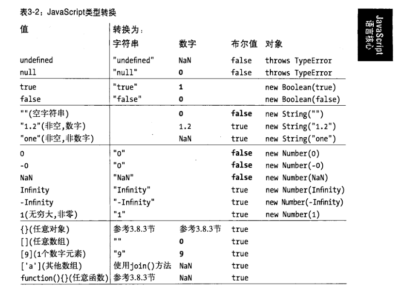

20190801 期 -- wqjiao

# 一、有趣的 Element & CSS

## 1.设置元素 display: block,一定会填充父元素宽度么

`div hn ul table p pre span a b input img ...`

<details><summary><b>解析</b></summary>
<p>

但是， `input textarea img button select...` 例外，设置 `display: block` 时，虽然独占一行，但是并没有填充父元素的宽度。

* `input` 其默认宽度取决于 size 特性的值 20
    width: (size - 1) * 7 + 40

* `textarea` 其默认宽度取决于 cols 特性的值 20
    width: (cols - 1) * 7 + 30

* `img` 其默认宽度有图片大小决定

* `button` 其默认宽度由内容决定，空 -- offsetWidth： 16

* `select` 其默认宽度由内容决定，空 -- offsetWidth： 24

设置 `width: 100%` 填充父元素宽度。

</p>
</details>


另外，设置 `display: inline-block;` 元素宽度填充父元素,也可以使用 `fill-available`

```css
input {
    width: -webkit-fill-available;
    width: fill-available;
}

span {
    display: inline-block;
    width: -webkit-fill-available;
    width: fill-available;
}
```

有趣的是，当父元素设置 `display: flex;`，给所有子元素设置 `fill-available`,相当于父元素平分 `flex: 1`

## 2.object-fit

[object-fit](https://css-tricks.com/almanac/properties/o/object-fit/) 属性定义元素如何响应其内容框的高度和宽度。它用于图像、视频和其他可嵌入的媒体格式，并结合 `object-position` 属性。[object-fit](https://css-tricks.com/almanac/properties/o/object-fit/) 本身可以裁剪内联图像，控制它在框内进行压缩和拉伸。常在 ` <video src="" > <audio src="" >` 中使用，控制图像(视频)在盒子内的宽高。

* [replaced element](https://developer.mozilla.org/zh-CN/docs/Web/CSS/Replaced_element) 可替换(置换)元素

    就是带有 src 属性的元素，或者具有 type 属性且值为 image 的元素，还有其他可以是，也可以不是可替换元素的元素。

* [object-fit](https://css-tricks.com/almanac/properties/o/object-fit/)

    - `fill` 默认值，拉伸图像以适应内容框，不考虑宽高比
    - `contain` 增加或减小图像的大小，保持其宽高比
    - `cover` 填充盒子，保持其宽高比，但在此过程中经常剪切图像
    - `none` 忽略盒子的宽高，保留图像原始大小
    - `scale-down` 比较 none 和 contain 之间的差异，使用最小的尺寸


* object-position 图像在盒子内的位置 (bottom top left top center)

* background-image 背景图像

    - background-size 图形尺寸
    `auto` 默认值，保留原始大小;`contain` `cover`
    
    - background-position 图像位置 (bottom top left top center)

## 3.位置定位 position

* 绝对定位和固定定位

    同时设置 left 和 right 等同于隐式地设置宽度

    ```css
    span {
        position: absolute;
        /* position: fixed; */
        left: 0;
        right: 0;
    }
    ```

* 粘性定位

    - 固定导航栏在页面顶部(相当于 relative 到 fixed 过度的效果)

    ```css
    nav {
        position: -webkit-sticky;
        position: sticky;
        top: 0;
    }
    ```

    - 内容层次的滚动交互
    ```html
    <ul class="sticky">
        <li>
            <nav style="background: palegoldenrod">粘性标题1</nav>
            <p>文章内容文章内容文章内容文章内容文章内容文章内容文章内容文章内容文章内容文章内容文章内容文章内容文章内容文章内容文章内容文章内容文章内容文章内容文章内容文章内容</p>
        </li>
        <li>
            <nav style="background: pink">粘性标题2</nav>
            <p>文章内容文章内容文章内容文章内容文章内容文章内容文章内容文章内容文章内容文章内容文章内容文章内容文章内容文章内容文章内容文章内容文章内容文章内容文章内容文章内容</p>
        </li>
        <li>
            <nav style="background: aliceblue">粘性标题3</nav>
            <p>文章内容文章内容文章内容文章内容文章内容文章内容文章内容文章内容文章内容文章内容文章内容文章内容文章内容文章内容文章内容文章内容文章内容文章内容文章内容文章内容</p>
        </li>
        <li>
            <nav style="background: antiquewhite">粘性标题4</nav>
            <p>文章内容文章内容文章内容文章内容文章内容文章内容文章内容文章内容文章内容文章内容文章内容文章内容文章内容文章内容文章内容文章内容文章内容文章内容文章内容文章内容</p>
        </li>
    </ul>
    ```

    - sticky 元素受限于父级元素

    1.父级元素不能有任何 `overflow:visible` 以外的 `overflow` 设置，否则没有粘滞效果。因为改变了滚动容器（即使没有出现滚动条）。因此，如果你的 `position:sticky` 无效，看看是不是某一个祖先元素设置了 `overflow:hidden`，移除之即可。

    <!-- 2.父级元素也不能设置固定的 `height` 高度值，否则也没有粘滞效果。 -->

    3.同一个父容器中的 `sticky` 元素，如果定位值相等，则会重叠；如果属于不同父元素，则会鸠占鹊巢，挤开原来的元素，形成依次占位的效果。

    4.`sticky` 定位，不仅可以设置 `top` ，基于滚动容器上边缘定位；还可以设置 `bottom`，也就是相对底部粘滞。如果是水平滚动，也可以设置 `left` 和 `right` 值。

    - [张鑫旭文章](https://www.zhangxinxu.com/wordpress/2018/12/css-position-sticky/)
    - [老姚文章](https://mp.weixin.qq.com/s?__biz=Mzg5ODA5NTM1Mw==&mid=2247484178&idx=1&sn=e89dc635024c6c114f30f778920e09a6&chksm=c0668284f7110b92a0faac651109d4a951efef7a4f86f8b94d27779cc7aa785992f9c75e8903&mpshare=1&scene=1&srcid=0801gRZzMKSVGff4OXH7wkZT&sharer_sharetime=1564617559725&sharer_shareid=b630f73da8ebb7bd9a5c1dc831668f59&key=313f257bb4a0297bf7b882b6b98c373afa2fd984fa7a6e29b469c80739ffe7d24bbe6c0755763caccb07c4432d4e7cf7126253205f6b73df233862833825a6d6ba422dae1fdd05faf75410d3e4debba4&ascene=1&uin=MTkxMzg2MjA0MA%3D%3D&devicetype=Windows+7&version=62060833&lang=zh_CN&pass_ticket=kDzqwY5GNW%2BRcT900W50e9ZD6ul1%2Bg5QCuS36wRyFNE4Muc133Oe1wL9mc7rRmGt)

## 4.隐藏文案的四种方式

```css
p {
    text-indent: -100000px; /* 元素及空间还在 */
    visibility: hidden; /* 元素及空间还在 */
    font-size: 0;
    display: none;
}
```

## 5.正确使用 `outline`

`outline` 描边，不占据多余的空间位置，可置外亦可置内 `outline-offset`

```css
.outline li:hover {
    outline: 10px solid pink;
    outline-offset: -10px;

    outline: 1000px solid #00000099;
}
```

## 6. 一个元素实现饼图效果

```css
.gradient {
    width: 100px;
    height: 100px;
    border-radius: 50%;
    background: conic-gradient(red 0 30%, green 30% 60%, blue 60% 100%);
}
```

## 7.`filter: blur(2px)` 滤镜特效


# 二、俏皮的 JavaScript

## 1.比较以下用法

* 对象与集合 [腾讯开发者手册](https://cloud.tencent.com/developer/section/1192069)

```js
const arr = [1, 2, 3, 4, 5];
const obj = { 1: 'a', 2: 'b', 3: 'c' }
const set = new Set([1, 2, 3, 4, 5])

obj.hasOwnProperty('1');
obj.hasOwnProperty(1);
set.has('1');
set.has(1);
```

<details><summary><b>解析</b></summary>
<p>

所有对象的键（不包括 Symbol）在底层都是字符串，即使你自己没有将其作为字符串输入。 所以 obj.hasOwnProperty('1') 也返回 true。

对于集合，它不是这样工作的。在我们的集合(集合类：Array、Map、Set)中没有 '1'值,set.has('1') 返回 false。它有数字类型为 1，set.has(1) 返回 true。

</p>
</details>


* 对象键值对

```js
const a = {}
const b = { key: 'b' }
const c = { key: 'c' }

a[b] = 123
a[c] = 456

console.log(a[b])
```

- A: 123
- B: 456
- C: undefined
- D: ReferenceError

<details><summary><b>解析</b></summary>
<p>

对象的键被自动转换为字符串。我们试图将一个对象 b 设置为对象 a 的键，且相应的值为 123。

然而，当字符串化一个对象时，它会变成 "[object Object]"。因此这里说的是，a["[object Object]"] = 123。然后，我们再一次做了同样的事情，c 是另外一个对象，这里也有隐式字符串化，于是，a["[object Object]"] = 456。

然后，我们打印 a[b]，也就是 a["[object Object]"]。之前刚设置为 456，因此返回的是 456

</p>
</details>


## 2.运算符

* 按位或运算符 `|`
    数字取整 `num | 0`

* 非运算符 `~`

    - 单非运算符 `~`

    ```js
    let firstname = "Ma";
    let fullname = "Jack Ma";

    let isExist = !!~fullname.indexOf(firstname); // true
    let isExist = fullname.indexOf(firstname) > 0; // true
    ```

    - 双非运算符 `~~`

    `~~` 返回一个整数，可以将字符串转换成数字类型，相当于取整 `| 0`。

    ```js
    4.5 | 0 // 4

    ~~4.5 // 4
    Math.floor(4.5) // 4
    Math.ceil(4.5)  // 5

    ~~-4.5 // -4
    Math.floor(-4.5) // -5
    Math.ceil(-4.5) // -4
    ```

* 按位与运算符 `&`
    
    - 判断奇数： `num & 1`
    - 判断偶数: `num % 2`

* 加法运算符 `+`

`{} + [] === [] + {}` 结果

- true
- false
- TypeError

<details><summary><b>解析</b></summary>
<p>


</p>
</details>

```
> [] + []
""

> {} + {}
"[object Object][object Object]"

> {} + []
0

> [] + {}
"[object Object]"

> {} + [] === [] + {}
true

> [] == []
false
> [] == {}
false

> [] == 0
true
> [] == ![]
true
```
