## 典型 bug / 注意点 汇总

### 1.保证 token 的获取是最新值

系统登录后会返回相应的 `token`，前端将 `token` 存在本地浏览器的 `localStorage` 中，每次做接口相关操作时再将 token 传至后端。

* 写法

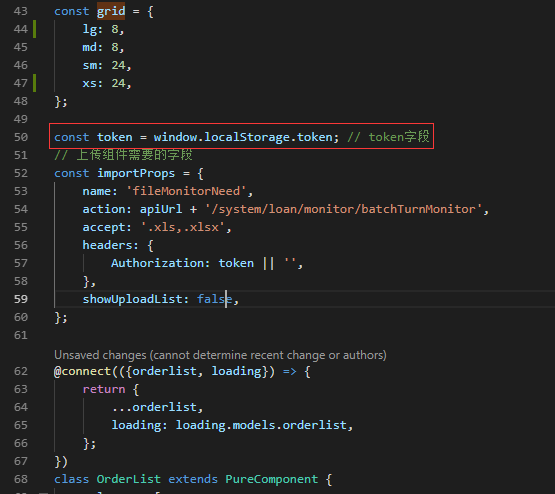

* 场景

- 1.账号重复登录，前面登录系统的用户会被踢出，重新登录(没有F5刷新)
- 2.用户自主退出切换账号(没有F5刷新)

* 问题

用户的操作出现以上两种情况时，`上传/下载文件`时，提交给用户的 `token` 不是最新的，导致`上传/下载失败`

* 原因

有时候组件中有多处使用到 `token`，该程序员可能是为了避免组件中多次渲染获取 `token`。

用户做相关相关操作时，浏览器并没有刷新，我们的系统是单页面应用且组件对应的文件已经加载进来了，即使组件内部重新渲染了，本地 `localStorage` 也更新了，但是文件并没有重新获取，所以获取的 `token` 还是原来的，即不是最新的。

* 解决

- 用户每次登录时，刷新(F5)下浏览器 (×)
- 在组件类的内部获取 `token`并存下来，或者是使用时再获取 `token`，保证使用时是最新的 `token` (√)

### 2.保证 Table 操作列是最新的

这个问题是与第一个 `bug` 是类似的。

数据列表，显示数据及操作项，由于不同账号列表的操作按钮的权限是不一样的，前端需要根据不同账号返回的权限展示操作按钮。

* 写法

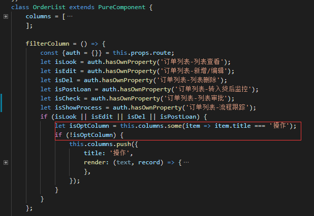

* 场景

- 1.账号重复登录，前面登录系统的用户会被踢出，重新登录(没有F5刷新)
- 2.用户自主退出切换账号(没有F5刷新)

* 问题

列表中显示了当前账户没有的操作按钮，获取有的操作按钮并没有展示，用户操作时接口报错，没有响应权限或者用户想做的操作并没有相应的按钮提供。

* 原因

写法有问题，可能该程序员是为了减少这块代码的多次重复渲染(性能优化)，在代码中做了一层判断 `let isOptColumn = this.columns.some(item => item.title === '操作')`, 大致意思就是，如果表头里面已经存在 `操作` 列了就证明已经渲染成功了，后面就不需要在做渲染。但是如果切换账号并没有刷新浏览器(F5)的话，也是不会再渲染操作选项的代码，导致操作列按钮没有更新。

* 解决

- 用户每次登录时，刷新(F5)下浏览器 (×)
- 删除该层判断，保证列表更新 (√)

### 3.同级 FormItem 的响应式栅格保持一致，如 md={8} sm={24} --> 防止在手机/小屏幕时出现元素覆盖，点击区域受影响;

* 写法

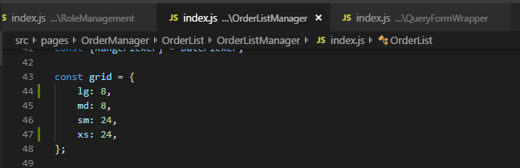
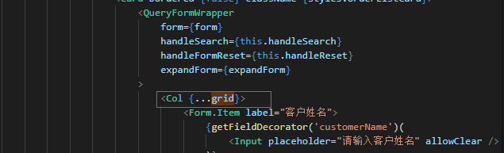
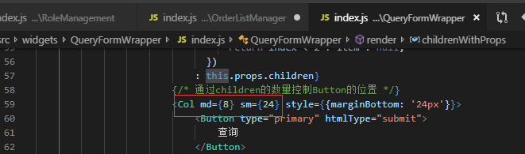

* 场景

H5/小屏幕

* 问题

小屏幕使用该页面时，下面的查询按钮会覆盖上方的筛选项，导致做不了筛选操作。

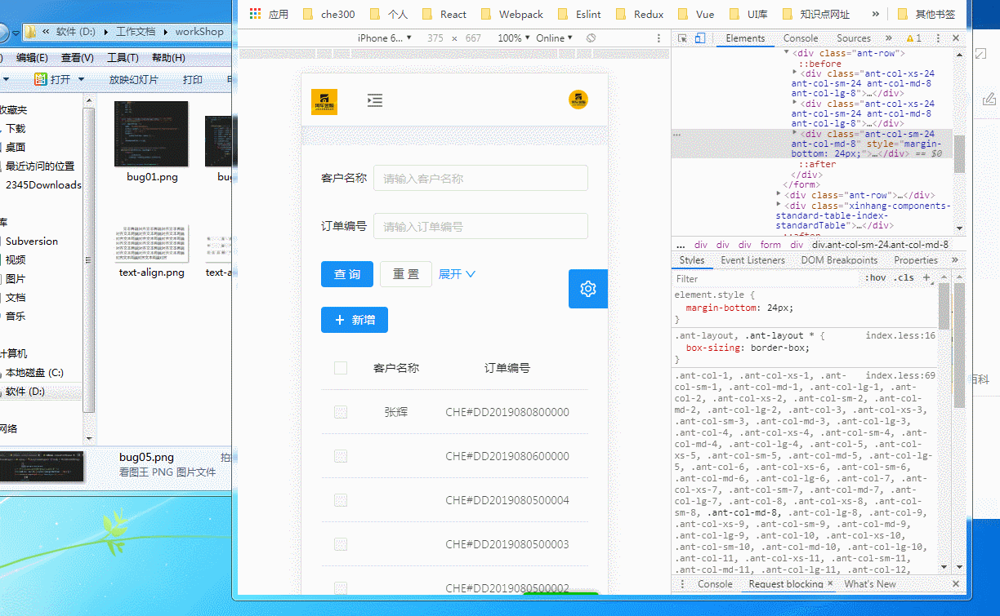

* 原因

`FormItem` 的响应式栅格选项不一致

* 解决

`FormItem` 的响应式栅格选项保持一致

### 4.model 中的数据应尽量在组件卸载时，参数数据复位

详情页中获取的数据存放在 `model` 中时，下次进入页面更新当前参数数据，需要先做一次数据清除 --> 防止下次进入页面时，当前参数无值，保留上次进入页面带入的值(即使数据已更新);
`componentDidMount` 中 fetch 数据，在 `componentWillUnmount` 中 clear 数据,子组件已存在，数据没有做卸载处理

```js
export default {
    namespace: 'models',

    state: {
        infoData: {
            optType: '',
            customer: {},
            customerNatural: {},
        },
    },
    // ...
    reducers: {
        clear() {
            return {
                infoData: {
                    optType: '',
                    customer: {},
                    customerNatural: {},
                },
            };
        }
    }
}
```
```js
componentWillUnmount() {
    this.props.dispatch({
        type: 'models/clear'
    });
}
```

### 5.自定义组件 -- 注意点

* 添加事件监听时，注意在组件卸载同时删除之前添加的事件监听。

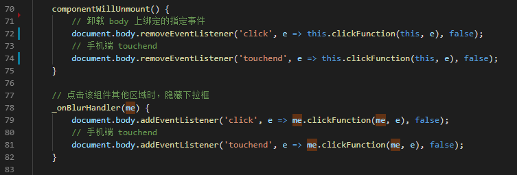

* `target` 与 `currentTarget` 的使用

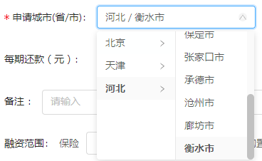

`target` 指向用户触发的元素(真正发出者)

`currentTarget` 始终是指向时间绑定的元素(监听事件者)

* 定义电子签名 -- 手动绘制位置

- 写法

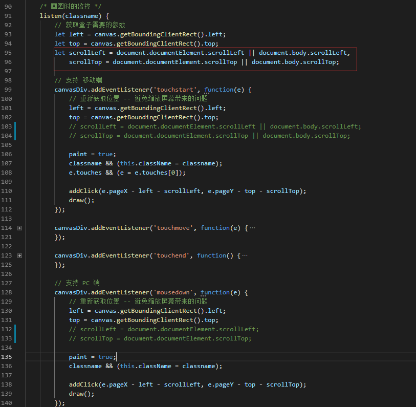

- 场景

打开绘图弹窗时，进行绘图，不关闭弹窗的前提下，缩小浏览器窗口，再次绘图时

- 问题

再次绘图时，会出现绘制路径与实际操作路径有偏差，偏移一定的位置

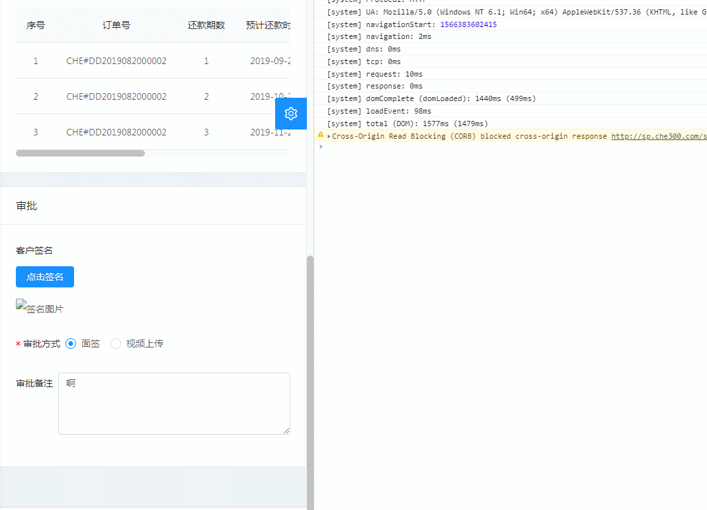

- 原因

代码中只在进入画面监控时获取了相对屏幕的上/左间距，设置绘制路径的开始坐标，缩小屏幕时，如果出现滚动条，实际上的上/左滚动间距已经发生改变，但并没有获取最新滚动间距。

- 解决

在绘制路径开始 (mousedown/touchstart)时，获取最新滚动间距。

* 封装 BizCharts -- 单调数据，title为日期时，range不起作用

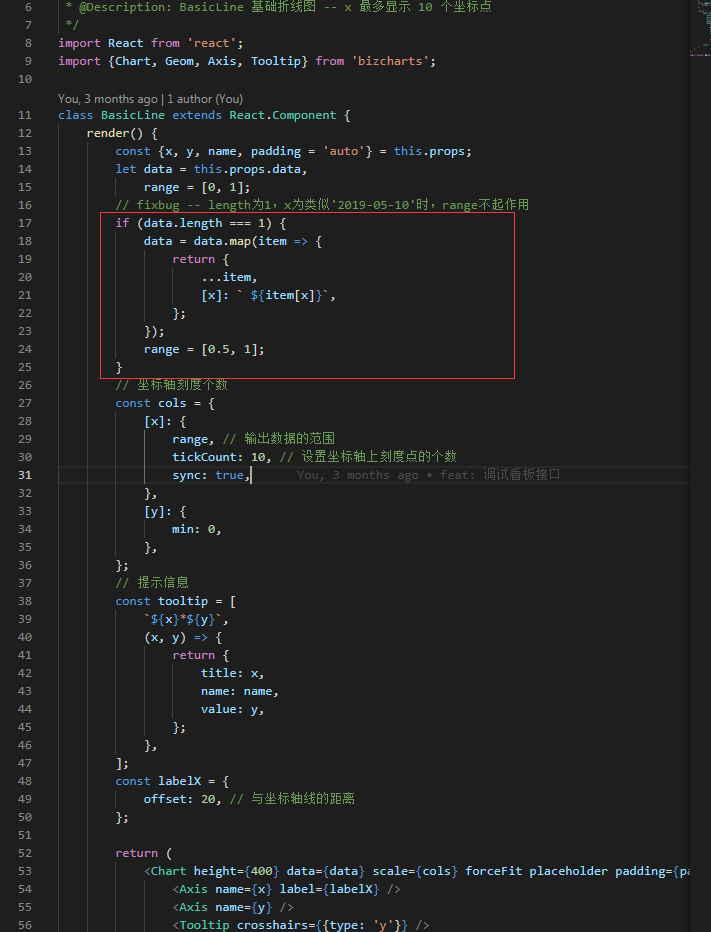

* 使用 `antd Form` 表单，自定义组件时，不能设置默认初始值 `defaultProps`，否则会报错。

`Warning: 'getFieldDecorator' will override 'value', so please don't set 'value' directly and use 'setFieldsValue' to set it.`

### 6.防止内存泄漏

`Warning: Can't perform a React state update on an unmounted component. This is a no-op, but it indicates a memory leak in your application. To fix, cancel all subscriptions and asynchronous tasks in the componentWillUnmount method.`

警告:无法对卸载的组件执行响应状态更新。这是一个no-op，但它表明您的应用程序中存在内存泄漏。要修复此问题，请取消componentWillUnmount方法中的所有订阅和异步任务。

